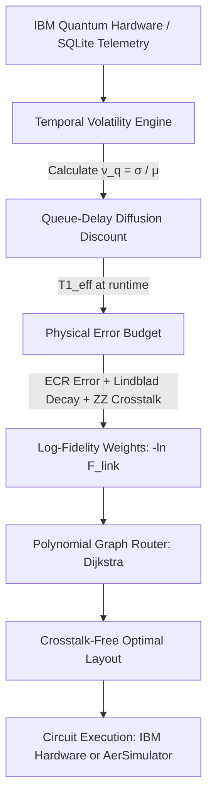

# ⚛️ NeuroQ [Research Grade]
### *Volatility-Aware Quantum Hardware Telemetry & Adaptive Compiler Engine*

[](https://www.python.org/)
[](https://qiskit.org/)
[](https://streamlit.io/)
[](https://quantum.ibm.com/)
[](LICENSE)

---

## 📖 Executive Summary

**NeuroQ** is a research-grade quantum hardware intelligence and adaptive compilation dashboard designed to bridge the gap between noisy superconducting transmon hardware and circuit execution. Connecting directly to **IBM Quantum** processors (e.g., Eagle and Heron architectures), NeuroQ continuously monitors calibration drift, models Two-Level System (TLS) defect dynamics, predicts queue-delayed coherence degradation, and synthesizes optimal, crosstalk-isolated qubit layouts using a physically derived quantum error budget.

Unlike conventional quantum compilers that treat calibration metrics as static snapshots, NeuroQ introduces **temporal volatility tracking** and **queue-delay diffusion discounting**, enabling researchers to map circuits to qubits that remain stable while waiting in cloud execution queues.

---

## 🎯 The Problem: Temporal Blindness in Quantum Compilers

Modern quantum compilers (e.g., Qiskit's `NoiseAdaptiveLayout`, SABRE, and Mapomatic) evaluate hardware metrics at the exact instant of compilation. However:
1. **Calibration Recurrence:** IBM Quantum devices undergo automated recalibration once every 12 to 24 hours.
2. **Cloud Queue Latency:** User circuits frequently sit in execution queues for **15 to 60 minutes** before hitting physical qubits.
3. **Stochastic TLS Hopping:** Transmon qubits exhibit non-Markovian $1/f$ noise and random fluctuations in $T_1$ relaxation time caused by microscopic Two-Level System (TLS) defects hopping in and out of resonance.

A static compiler cannot distinguish between a qubit that is consistently stable ($T_1 = 120 \pm 4\ \mu s$) and one that oscillates wildly between $40\ \mu s$ and $180\ \mu s$. If mapped to the volatile qubit, circuit fidelity collapses by the time the job executes.

---

## 🔬 Mathematical & Theoretical Framework

NeuroQ replaces arbitrary heuristics with a rigorous, mathematically derived physical error budget:



### 1. Physical Link Fidelity $\mathcal{F}_{\text{link}}$
Every coupling edge $(u, v)$ on the device graph is assigned a physical fidelity $\mathcal{F}_{\text{link}} \in [0, 1]$ derived from Lindbladian decoherence and transmon Hamiltonian physics:

$$\mathcal{F}_{\text{link}}(u, v) = \mathcal{S}_{\text{gate}} \times \mathcal{S}_{\text{decay}} \times \mathcal{S}_{\text{crosstalk}}$$

Where:
* **Incoherent Gate Survival:** $\mathcal{S}_{\text{gate}} = 1 - \epsilon_{\text{ECR}}$ (measured two-qubit cross-resonance error rate).
* **Decoherence Survival:** $\mathcal{S}_{\text{decay}} = \exp\left(-\frac{\tau_{\text{gate}}}{T_{1,\text{eff}}^{\min}} - \frac{\tau_{\text{gate}}}{T_{2,\text{eff}}^{\min}}\right)$, with $\tau_{\text{gate}} \approx 500\text{ ns}$.
* **Coherent $ZZ$-Crosstalk Survival:** $\mathcal{S}_{\text{crosstalk}} = 1 - \frac{\zeta_{ZZ}^2}{\Delta f^2 + \zeta_{ZZ}^2}$, where $\Delta f = |f_u - f_v|$ is the microwave detuning and $\zeta_{ZZ} \approx 17\text{ MHz}$ is the static parasitic transmon coupling parameter.

### 2. Temporal Volatility Metric ($\nu_q$)
Using historical time-series calibration snapshots recorded in the database, NeuroQ computes the Allan-style coefficient of variation for each qubit:

$$\nu_q = \frac{\sigma(T_1^{(q)})}{\bar{T}_1^{(q)}} = \frac{\sqrt{\frac{1}{N-1} \sum_{i=1}^N \left(T_{1, i} - \bar{T}_1\right)^2}}{\bar{T}_1}$$

* $\nu_q < 0.12$: **Rock-Solid Stability** (qubit is safely decoupled from active TLS defects).
* $\nu_q > 0.25$: **Active TLS Hazard** (high probability of stochastic frequency/coherence jumping).

### 3. Queue-Delay Diffusion Discounting
Given an estimated queue latency $\Delta t_{\text{queue}}$ (in minutes) and calibration window $\tau_{\text{cal}} = 1440\text{ min}$ (24 hours), the expected 95% lower-bound effective coherence at runtime is:

$$T_{1, q}^{\text{eff}}(\Delta t_{\text{queue}}) = \max\left(10.0\ \mu s,\ T_{1, q}^{\text{live}} \cdot \left[1 - 1.96 \cdot \nu_q \cdot \sqrt{\frac{\Delta t_{\text{queue}}}{\tau_{\text{cal}}}}\right]\right)$$

### 4. Polynomial Log-Fidelity Graph Routing
To maximize the total circuit fidelity product $\prod_{(u, v)} \mathcal{F}_{\text{link}}(u, v)$, NeuroQ assigns additive edge weights:

$$w(u, v) = -\ln\left(\mathcal{F}_{\text{link}}(u, v)\right) \ge 0$$

Finding the optimal path minimizes $\sum w(u, v)$, which is solved in polynomial time $\mathcal{O}(V + E \log V)$ via Dijkstra's algorithm, avoiding combinatorial explosion.

---

## 🌟 Key Features

* **Multi-Mode Architecture:** Seamlessly operates in **Live IBM Quantum Mode** (real-time Qiskit Runtime API) and **Offline / Database Replay Mode** (using >13,000 verified historical calibration records for `ibm_fez`, `ibm_torino`, `ibm_marrakesh`, and `ibm_kingston`).
* **Cloud Queue Latency Simulator:** An interactive slider ($0 - 60\text{ min}$) allowing developers to test how queue wait times degrade individual qubit fidelities before job submission.
* **Physical Chip Health Index (PCHI):** A single composite metric ($0 - 100$) reflecting mean link fidelity, chip-wide TLS stability, and the healthy qubit population fraction.
* **Bad Qubit Hunter (Zone 6):** Scans for anomalous readout, low $T_1$, or excessive gate error, with one-click automatic exclusion from the compilation graph.
* **Spectroscopic Router (Zone 7):** Synthesizes connected chains of length $K = 2 \dots 8$ that avoid parasitic $ZZ$ collisions.
* **Operation-Aware Layout Advisor (Zone 9):** Provides customized physical layouts and estimated circuit success probabilities for standard quantum operations (Bell/CHSH tests, Quantum Teleportation, VQE chains, QAOA).
* **AI Scientist with 3 Physics Guardrails:** Integrated Mistral LLM analysis backed by a deterministic physics engine that enforces gate error thresholds, coherence limits for teleportation, and SWAP-chain warnings.
* **Empirical Hypothesis Testing (`analysis_stats.py`):** Includes Welch's two-sample $t$-test and Cohen's $d$ effect size computations to statistically validate layout improvements.

---

## 📁 Repository Structure

```text
NeuroQ/
├── app.py                  # Main Streamlit application and research dashboard (~1,800 lines)
├── analysis_stats.py       # Statistical hypothesis testing (Welch t-test, Cohen's d)
├── success_metrics.py      # Quantum fidelity metrics (Bell state, ZZ expectation, counts parsing)
├── neuroq_history.db       # SQLite database with 13,000+ real IBM calibration records
├── Untitled41.ipynb        # Exploratory research notebook and Qiskit circuit scratchpad
├── FIXES_APPLIED.md        # Engineering log detailing stability & scientific fixes
├── QUICK_REFERENCE.md      # Summary of architectural optimizations
├── TESTING_CHECKLIST.md    # 11-step manual and automated testing checklist
├── COMPLETION_REPORT.txt   # Engineering status report
├── README.md               # Project documentation
└── .gitignore              # Git ignore rules
```

---

## 🚀 Quickstart & Installation

### Prerequisites
* Python 3.10, 3.11, 3.12, or 3.13
* Virtual environment (recommended)

### 1. Clone the Repository
```bash
git clone https://github.com/ashutosh-013/NeuroQ.git
cd NeuroQ
```

### 2. Install Dependencies
```bash
pip install streamlit qiskit qiskit-ibm-runtime qiskit-aer plotly scipy networkx pandas scikit-learn mistralai
```

### 3. Launch the Dashboard
```bash
streamlit run app.py
```
Open **`http://localhost:8501`** in your browser.

---

## ⚙️ Configuration & Modes

NeuroQ provides an interactive **API Credentials & Keys** expander in the sidebar:

| Parameter | Description |
| :--- | :--- |
| **IBM Quantum API Token** | Your IBM Quantum / IBM Cloud API token from [quantum.ibm.com](https://quantum.ibm.com/). |
| **IBM Instance CRN** | *(Optional)* Dedicated Cloud instance CRN if using enterprise cloud hubs. |
| **Mistral AI API Key** | *(Optional)* Mistral AI API key for natural language quantum physics reports. |
| **Operation Mode** | Choose between `Auto (Live IBM)`, `Live IBM Quantum`, or `Offline / DB Replay`. |
| **Queue Wait Slider** | Adjust expected queue latency ($0 - 60\text{ min}$) to inspect real-time drift discounting. |

> **Note:** If an IBM API token is missing, expired, or pending instance provisioning, NeuroQ **automatically switches to Offline / DB Replay Mode**, allowing you to explore the full dashboard using 13,000+ real IBM calibration records.

---

## 🧪 Statistical Validation (`analysis_stats.py`)

Run automated statistical hypothesis testing on recorded job outcomes:
```bash
python analysis_stats.py --backend ibm_fez
```

Example output:
```text
Loaded 5 rows from job_outcomes for backend=ibm_fez.

Per-condition summary (success_metric):
             count  mean   std   sem  ci95_low  ci95_high
job_type                                                 
Bell_counts      1 0.969   NaN   NaN       NaN        NaN
manual           4 0.800 0.000 0.000     0.800      0.800

[!] Not enough samples for Welch t-test (manual: n=4, Bell_counts: n=1; need >= 2 each).
```

---

## 🤝 Contributing

Contributions are welcome! If you would like to contribute:
1. Fork the repository.
2. Create a feature branch: `git checkout -b feature/quantum-enhancement`.
3. Commit your changes: `git commit -m "Add novel noise filter"`.
4. Push to the branch: `git push origin feature/quantum-enhancement`.
5. Open a Pull Request.

---

## 📄 License

This project is licensed under the MIT License - see the [LICENSE](LICENSE) file for details.

---

## 📬 Contact & Citation

**Author:** [ashutosh-013](https://github.com/ashutosh-013)  
**Repository:** [https://github.com/ashutosh-013/NeuroQ](https://github.com/ashutosh-013/NeuroQ)  
If you use NeuroQ in your academic work, please consider citing this repository.
