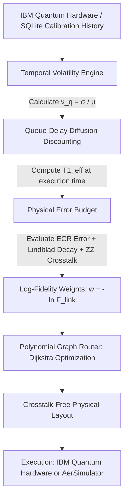

# ⚛️ NeuroQ [Research Grade]
### *Volatility-Aware Quantum Hardware Telemetry & Adaptive Compilation Platform*

[](https://www.python.org/)
[](https://qiskit.org/)
[](https://streamlit.io/)
[](https://quantum.ibm.com/)
[](LICENSE)

---

## 📌 Overview

**NeuroQ** is an open-source, research-grade quantum hardware intelligence and adaptive compilation dashboard designed for superconducting transmon quantum computers. Connecting to live **IBM Quantum** hardware (e.g., 156-qubit Heron and 127-qubit Eagle chips) as well as offline high-precision calibration databases, NeuroQ continuously interrogates device telemetry, tracks temporal Two-Level System (TLS) defect volatility, models cloud queue-delay coherence drift, and synthesizes crosstalk-isolated qubit layouts using a physically derived quantum error budget.

Unlike conventional quantum compilers that evaluate hardware metrics as frozen, static snapshots, NeuroQ incorporates **temporal volatility metrics ($\nu_q$)** and **queue-delay diffusion discounting**, allowing researchers to select layouts that maintain maximum fidelity when a circuit actually executes on physical quantum processors.

---

## 🧭 Why NeuroQ? The Temporal Drift Challenge

Modern quantum compilers (e.g., Qiskit's `NoiseAdaptiveLayout`, SABRE, and Mapomatic) evaluate hardware calibrations at the exact instant of compilation. However, real quantum cloud workflows face three physical bottlenecks:

1. **Periodic Calibration Batches:** IBM Quantum processors undergo automated recalibration cycles typically once every 12 to 24 hours.
2. **Cloud Queue Latency:** User circuits regularly wait in multi-tenant cloud execution queues for **15 to 60 minutes** before physical execution.
3. **Stochastic TLS Defect Hopping:** Superconducting transmon qubits experience non-Markovian $1/f$ noise and stochastic fluctuations in energy relaxation time ($T_1$) caused by microscopic Two-Level System (TLS) defects hopping in and out of resonance in the Josephson junction dielectric.

A static compiler cannot distinguish between a qubit that is temporally stable ($T_1 = 120 \pm 4\ \mu s$ over days) and one that oscillates wildly between $40\ \mu s$ and $180\ \mu s$. If mapped to a volatile qubit, circuit fidelity collapses by the time the job reaches the front of the queue. NeuroQ solves this by factoring historical stability and queue wait times directly into the routing objective.

---

## 📐 Mathematical & Physical Framework

NeuroQ rejects ungrounded additive scoring heuristics (e.g., arbitrary sums of error and coherence) in favor of a dimensionless physical error budget derived from Lindbladian decoherence and transmon Hamiltonian dynamics.



### 1. Physical Link Fidelity ($\mathcal{F}_{\text{link}}$)
For each physical coupling link $(u, v)$ on the hardware lattice, the link fidelity $\mathcal{F}_{\text{link}} \in [0, 1]$ is computed as the product of three distinct physical survival probabilities:

$$\mathcal{F}_{\text{link}}(u, v) = \mathcal{S}_{\text{gate}} \times \mathcal{S}_{\text{decay}} \times \mathcal{S}_{\text{crosstalk}}$$

* **Incoherent Gate Survival ($\mathcal{S}_{\text{gate}}$):**
  $$\mathcal{S}_{\text{gate}} = 1 - \epsilon_{\text{ECR}}$$
  *(where $\epsilon_{\text{ECR}}$ is the calibrated two-qubit cross-resonance gate error rate).*
* **Incoherent Decoherence Survival ($\mathcal{S}_{\text{decay}}$):**
  $$\mathcal{S}_{\text{decay}} = \exp\left(-\frac{\tau_{\text{gate}}}{T_{1,\text{eff}}^{\min}} - \frac{\tau_{\text{gate}}}{T_{2,\text{eff}}^{\min}}\right)$$
  *(where $\tau_{\text{gate}} \approx 500\text{ ns}$ is the cross-resonance pulse duration, $T_{1,\text{eff}}^{\min} = \min(T_{1,u}^{\text{eff}}, T_{1,v}^{\text{eff}})$, and $T_{2,\text{eff}}^{\min} \approx \min(T_1, 1.2 T_1)$).*
* **Coherent $ZZ$-Crosstalk Survival ($\mathcal{S}_{\text{crosstalk}}$):**
  $$\mathcal{S}_{\text{crosstalk}} = 1 - \frac{\zeta_{ZZ}^2}{\Delta f^2 + \zeta_{ZZ}^2}$$
  *(where $\Delta f = |f_u - f_v|$ is the microwave driving frequency detuning and $\zeta_{ZZ} \approx 17\text{ MHz}$ is the static parasitic transmon $ZZ$-coupling parameter).*

### 2. Temporal Volatility Index ($\nu_q$)
Borrowing from Allan deviation in precision quantum metrology, NeuroQ calculates the empirical coefficient of variation over the historical calibration time-series:

$$\nu_q = \frac{\sigma(T_1^{(q)})}{\bar{T}_1^{(q)}} = \frac{\sqrt{\frac{1}{N-1} \sum_{i=1}^N \left(T_{1, i} - \bar{T}_1\right)^2}}{\bar{T}_1}$$

* $\nu_q < 0.12$: **Rock-Solid Qubit** (qubit is physically decoupled from fluctuating TLS defects).
* $\nu_q \in [0.12, 0.25]$: **Moderate Drift** (nominal baseline variation).
* $\nu_q > 0.25$: **Active TLS Hazard** (high probability of stochastic coherence drops).

### 3. Queue-Delay Diffusion Discounting
Given an estimated queue latency $\Delta t_{\text{queue}}$ (in minutes) and a calibration window $\tau_{\text{cal}} = 1440\text{ min}$ (24 hours), the expected 95% worst-case lower-bound effective coherence at physical execution time is:

$$T_{1, q}^{\text{eff}}(\Delta t_{\text{queue}}) = \max\left(10.0\ \mu s,\ T_{1, q}^{\text{live}} \cdot \left[1 - 1.96 \cdot \nu_q \cdot \sqrt{\frac{\Delta t_{\text{queue}}}{\tau_{\text{cal}}}}\right]\right)$$

### 4. Polynomial Log-Fidelity Graph Routing
To maximize the total circuit fidelity product $\prod_{(u,v)} \mathcal{F}_{\text{link}}(u, v)$, NeuroQ maps physical links to non-negative additive weights:

$$w(u, v) = -\ln\left(\mathcal{F}_{\text{link}}(u, v)\right) \ge 0$$

Minimizing $\sum w(u, v)$ via Dijkstra's shortest-path algorithm mathematically maximizes the multiplicative quantum fidelity product in polynomial time $\mathcal{O}(V + E \log V)$, eliminating combinatorial latency on large chips.

---

## 🎛️ Complete System Architecture & Dashboard Features

The dashboard is structured into 10 specialized zones and 4 functional tabs:

| Zone / Component | Functionality |
| :--- | :--- |
| **Credentials & Multi-Mode Sidebar** | Supports interactive IBM Quantum API token and Mistral API key entry. Enables switching between **Live IBM Quantum** mode and **Offline / DB Replay** mode with automatic fallback. |
| **Cloud Queue Latency Simulator** | Interactive slider ($0 - 60\text{ min}$) dynamically discounting physical qubit coherences and link fidelities in real time. |
| **KPI HUD Row** | Real-time telemetry cards displaying: **Optimal Physical Link**, **Total Link Fidelity** ($\mathcal{F}_{\text{link}}$), **Effective $T_1$** (Queue-discounted), and **Crosstalk Isolation %**. |
| **Life of Pair (TLS Stability Forecast)** | Displays the Volatility Index $\nu_q$, TLS state classification, queue-discounted expected $T_1$, and an interactive Plotly graph showing historical $T_1$ data with 95% TLS fluctuation envelope. |
| **Physical Chip Health Index (PCHI)** | Composite benchmark score ($0 - 100$) evaluating mean link fidelity, chip-wide TLS stability, and the healthy qubit population fraction. |
| **Tab 1: 📉 ZNE Extrapolation** | Visualizes 2-qubit Bell state circuits; submits error-mitigated runs to real IBM hardware or local `AerSimulator`. |
| **Tab 2: 📜 True History** | Persistent SQLite telemetry visualizer showing real $T_1$ stability curves, frequency drift over time, and raw calibration records. |
| **Tab 3: 🤖 Mistral Analysis** | AI scientist analysis with multi-model fallback and an automated deterministic physics diagnosis engine enforcing 3 safety guardrails. |
| **Tab 4: 📈 Jobs vs Hardware** | Correlates circuit success metrics against minimum $T_1$ and average CNOT error; includes automated 2-qubit $ZZ$ energy probe execution and counts parser. |
| **Zone 5: Crosstalk Collision Heatmap** | Vectorized matrix broadcasting computing $|\Delta f| = |f_i - f_j|$ and flagging warning ($< 25\text{ MHz}$) and critical collision ($< 17\text{ MHz}$) zones. |
| **Zone 6: Full Chip Noise Scanner** | Scans for low $T_1$ ($< 30\ \mu s$), deaf readout ($> 5\%$), and high gate error ($> 2\%$), featuring one-click **Auto-Block Bad Qubits**. |
| **Zone 7: Spectroscopic Router** | Synthesizes connected chains of length $K = 2 \dots 8$ maximizing multiplicative link fidelity $\prod \mathcal{F}_{\text{link}}$, with Coherence Budgeting and Dynamical Decoupling code generation. |
| **Zone 8: Noise Fingerprints** | Aggregates empirical job success metrics per physical qubit from SQLite history to identify underperforming hardware nodes. |
| **Zone 9: Operation-Aware Layout Advisor** | Select target operations (Bell test, Teleportation, VQE chain, QAOA chain) to receive ranked physical layouts and estimated operational success probabilities $\mathcal{P}_{\text{success}} \approx \mathcal{F}_{\text{chain}}^{\text{depth}/2}$. |

---

## 🗄️ Database & Pre-Loaded Datasets (`neuroq_history.db`)

NeuroQ comes pre-loaded with **13,187 real, high-precision calibration records** across 4 IBM Quantum superconducting processors:

| Backend | Qubits | Architecture | Records in Database | Temporal Snapshots |
| :--- | :---: | :---: | :---: | :---: |
| **`ibm_fez`** | 156 | Heron (Heavy-Hex) | **7,644** | 49 full snapshots |
| **`ibm_marrakesh`** | 156 | Heron (Heavy-Hex) | **4,524** | 29 full snapshots |
| **`ibm_torino`** | 133 | Heron (Heavy-Hex) | **399** | 3 full snapshots |
| **`ibm_kingston`** | 155 | Heron (Heavy-Hex) | **620** | 4 full snapshots |

Even without an active internet connection or IBM API key, all routing, scoring, and statistical features execute seamlessly against real hardware data.

---

## 📂 Repository File Breakdown

```text
NeuroQ/
├── app.py                  # Core application: Streamlit UI, physics engine, router, AI diagnostics (~1,620 lines)
├── analysis_stats.py       # Statistical evaluation script: Welch's t-test, Cohen's d effect size, 95% CIs
├── success_metrics.py      # Physics metric functions: Bell state fidelity, ZZ Hamiltonian expectation, energy errors
├── neuroq_history.db       # Embedded SQLite database holding 13,187 calibration records and job outcomes
├── Untitled41.ipynb        # Exploratory Jupyter notebook with basic Qiskit circuits and Aer simulations
├── FIXES_APPLIED.md        # Technical audit log of stability, SQL safety, and routing optimizations
├── QUICK_REFERENCE.md      # Summary of engineering updates
├── TESTING_CHECKLIST.md    # 11-step verification suite for stability and scientific validity
├── COMPLETION_REPORT.txt   # Engineering status summary
├── README.md               # Complete platform documentation
└── .gitignore              # Git ignore rules for clean repository state
```

---

## 🚀 Installation & Quickstart

### 1. Prerequisites
* Python 3.10, 3.11, 3.12, or 3.13
* Windows, Linux, or macOS

### 2. Clone the Repository
```bash
git clone https://github.com/ashutosh-013/NeuroQ.git
cd NeuroQ
```

### 3. Install Dependencies
```bash
pip install streamlit qiskit qiskit-ibm-runtime qiskit-aer plotly scipy networkx pandas scikit-learn mistralai
```

### 4. Launch the Dashboard
```bash
streamlit run app.py
```
Open **`http://localhost:8501`** in your browser.

---

## 📊 Statistical Hypothesis Testing (`analysis_stats.py`)

NeuroQ provides a standalone script to statistically compare circuit success metrics across different layout strategies:

```bash
python analysis_stats.py --backend ibm_fez
```

### Features:
* Computes group mean, standard deviation, standard error, and 95% confidence intervals per condition.
* Runs **Welch's two-sample $t$-test** (robust to unequal variances and sample sizes).
* Computes **Cohen's $d$** to quantify effect size between layout strategies.

---

## 🔒 Security & AI Guardrails

NeuroQ implements three programmatic safety guardrails in its AI module:
1. **Critical Gate Error Warning:** Flags links with two-qubit gate error $\epsilon_{\text{ECR}} > 5\%$ as unsuitable for production circuits.
2. **Teleportation Coherence Check:** Intercepts suggestions for Quantum Teleportation if average $T_1 < 50\ \mu s$, warning the user about decoherence risks.
3. **SWAP Routing Alert:** Alerts against SWAP-heavy routing paths across coupling links with $> 3\%$ error rate.

---

## 📄 License

This project is licensed under the MIT License - see the [LICENSE](LICENSE) file for details.

---

## 📬 Citation & Contact

**Author:** [ashutosh-013](https://github.com/ashutosh-013)  
**Repository:** [https://github.com/ashutosh-013/NeuroQ](https://github.com/ashutosh-013/NeuroQ)  

If you use NeuroQ or its Volatility-Aware Error Budget in your research, please consider citing this repository.
